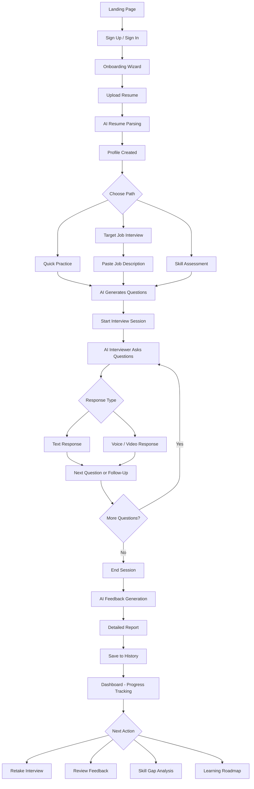
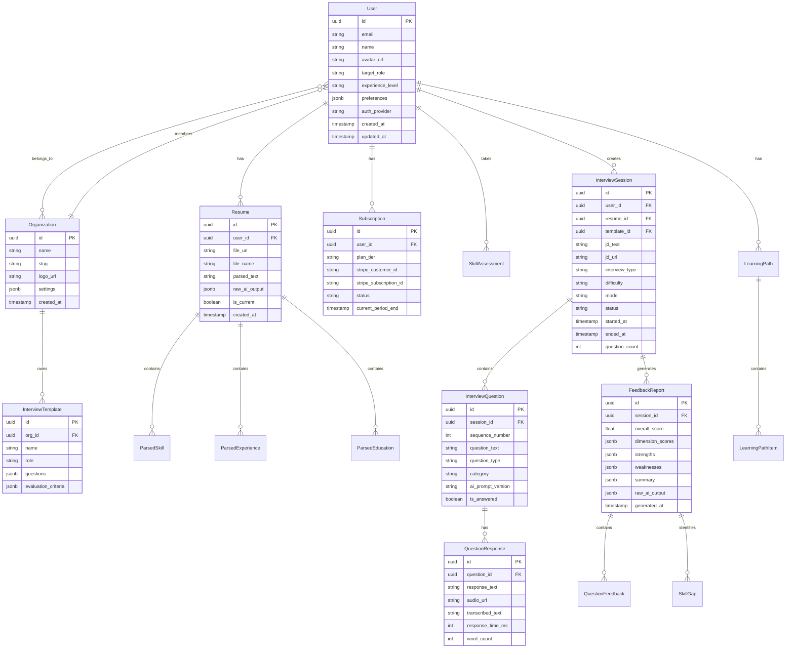
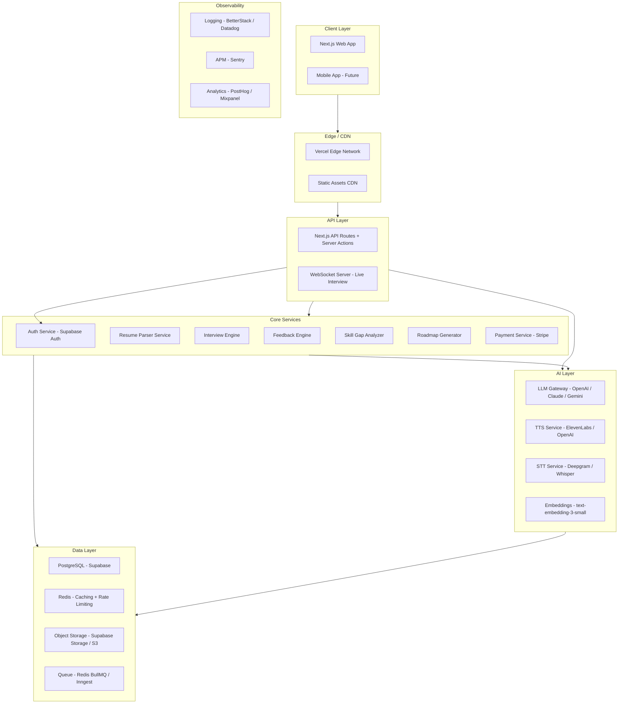

# AI Interview Copilot - Product Architecture Document

---

## Table of Contents

1. [Core Features](#1-core-features)
2. [User Journey](#2-user-journey)
3. [Database Design](#3-database-design)
4. [Modern SaaS Architecture](#4-modern-saas-architecture)
5. [Dashboard Components](#5-dashboard-components)
6. [AI Features](#6-ai-features)
7. [Tech Stack](#7-tech-stack)
8. [Security](#8-security)
9. [Future Improvements](#9-future-improvements)
10. [Product Roadmap](#10-product-roadmap)

---

## 1. Core Features

### 1.1 MVP Features (Phase 1)

| Feature | Description |
|---------|-------------|
| **Resume Upload & Analysis** | PDF/DOCX upload, AI-parsed structured profile, skill extraction |
| **AI Interview Question Generator** | Generates role-specific behavioral + technical questions from resume + JD |
| **Text-Based Mock Interview** | Chat-style AI interviewer with follow-up questions and probing |
| **AI Feedback Report** | Scores on clarity, relevance, confidence indicators; strengths + improvements |
| **User Dashboard** | Past interviews, progress charts, saved questions |
| **Auth & Profiles** | Email/password + Google OAuth, basic profile management |

### 1.2 Premium Features (Phase 2)

| Feature | Description |
|---------|-------------|
| **Voice Interview** | Speech-to-text input, AI listens and responds via TTS |
| **Real-Time AI Interviewer** | WebRTC-based video/audio with an AI avatar or voice agent |
| **Skill Gap Analysis** | Compares resume skills against target job market data |
| **Personalized Learning Roadmap** | Curated courses, practice topics, and resources |
| **Interview Recording & Replay** | Full session playback with timestamped feedback |
| **Multi-Language Support** | Interviews in 10+ languages |
| **LinkedIn Profile Import** | Auto-fill profile from LinkedIn |

### 1.3 Enterprise Features (Phase 3-4)

| Feature | Description |
|---------|-------------|
| **Team Hiring Portal** | Recruiters create standardized interview templates |
| **Company-Specific Prep** | Tailored interviews for FAANG, consulting, finance, etc. |
| **Mock Coding Interviews** | Live code editor + AI code reviewer |
| **Bulk Candidate Screening** | Batch resume upload, ranked shortlists |
| **Analytics Dashboard** | Team-wide hiring metrics, bias detection |
| **SSO / SAML** | Enterprise identity provider integration |
| **White-Label** | Custom branding, custom domain |
| **API Access** | REST API for HRIS/ATS integration |

---

## 2. User Journey

### 2.1 End-to-End Flow



### 2.2 Detailed Step Breakdown

#### Onboarding (First 60 Seconds)
1. User lands on homepage, clicks "Start Free"
2. Signs up via Google OAuth or email/password
3. Onboarding wizard: name, target role, experience level, industry
4. Prompted to upload resume (PDF/DOCX) - can skip
5. Resume parsed via AI, profile auto-populated
6. User lands on dashboard with a "Start Your First Interview" CTA

#### Resume Upload
1. Drag-and-drop upload area (max 10MB, PDF/DOCX)
2. File sent to AI parsing pipeline
3. Skills, experience, education, projects extracted
4. User reviews and edits parsed data
5. Structured profile saved to database

#### AI Interview Setup
1. User selects interview type: Behavioral, Technical, Case Study, or Mixed
2. Optionally pastes a job description URL or text
3. Chooses difficulty level: Entry, Mid, Senior, Staff
4. Selects question count (5, 10, 15, 20)
5. Chooses mode: Text, Voice, or Video
6. Clicks "Start Interview"

#### Live Interview
1. AI introduces itself as the interviewer
2. Asks first question (text or spoken)
3. User responds (types or speaks)
4. AI evaluates in real-time, may ask follow-ups
5. Progress bar shows remaining questions
6. User can mark questions to review later
7. Session ends when all questions answered or user ends early

#### Feedback Generation
1. Full transcript passed to feedback LLM pipeline
2. Scoring on dimensions: clarity, relevance, depth, confidence, structure
3. Per-question breakdown with AI commentary
4. Overall score and percentile
5. Strengths highlighted, weaknesses identified
6. Suggested improvements with example answers
7. Export as PDF option

#### Progress Tracking
1. Dashboard shows interview history with scores over time
2. Skill radar chart comparing across sessions
3. Weak area identification with trend lines
4. Streak tracking and achievement badges
5. Comparison to peer benchmarks (anonymized)

---

## 3. Database Design

### 3.1 Entity-Relationship Diagram



### 3.2 Suggested Prisma Schema (Core Tables)

```prisma
// schema.prisma

datasource db {
  provider = "postgresql"
  url      = env("DATABASE_URL")
}

generator client {
  provider = "prisma-client-js"
}

enum PlanTier {
  FREE
  PRO
  ENTERPRISE
}

enum InterviewMode {
  TEXT
  VOICE
  VIDEO
}

enum InterviewType {
  BEHAVIORAL
  TECHNICAL
  CASE_STUDY
  MIXED
}

enum DifficultyLevel {
  ENTRY
  MID
  SENIOR
  STAFF
}

enum SessionStatus {
  CREATED
  IN_PROGRESS
  COMPLETED
  ABANDONED
}

model User {
  id                  String             @id @default(uuid()) @db.Uuid
  email               String             @unique
  name                String?
  avatarUrl           String?
  targetRole          String?
  experienceLevel     String?
  authProvider        String             @default("email")
  emailVerified       DateTime?
  createdAt           DateTime           @default(now())
  updatedAt           DateTime           @updatedAt

  resumes             Resume[]
  sessions            InterviewSession[]
  subscription        Subscription?
  skillAssessments    SkillAssessment[]
  learningPaths       LearningPath[]
  orgMemberships      OrgMember[]

  @@map("users")
}

model Resume {
  id            String   @id @default(uuid()) @db.Uuid
  userId        String   @db.Uuid
  fileUrl       String?
  fileName      String
  parsedText    String?
  rawAiOutput   Json?
  isCurrent     Boolean  @default(false)
  createdAt     DateTime @default(now())

  user          User                 @relation(fields: [userId], references: [id])
  skills        ParsedSkill[]
  experiences   ParsedExperience[]
  educations    ParsedEducation[]
  sessions      InterviewSession[]

  @@map("resumes")
}

model ParsedSkill {
  id        String @id @default(uuid()) @db.Uuid
  resumeId  String @db.Uuid
  name      String
  category  String?
  level     String?
  yearsExp  Float?

  resume    Resume @relation(fields: [resumeId], references: [id])

  @@map("parsed_skills")
}

model ParsedExperience {
  id          String @id @default(uuid()) @db.Uuid
  resumeId    String @db.Uuid
  company     String
  title       String
  startDate   DateTime?
  endDate     DateTime?
  description String?
  highlights  Json?

  resume      Resume @relation(fields: [resumeId], references: [id])

  @@map("parsed_experiences")
}

model ParsedEducation {
  id        String @id @default(uuid()) @db.Uuid
  resumeId  String @db.Uuid
  school    String
  degree    String?
  field     String?
  startYear Int?
  endYear   Int?

  resume    Resume @relation(fields: [resumeId], references: [id])

  @@map("parsed_educations")
}

model InterviewSession {
  id              String        @id @default(uuid()) @db.Uuid
  userId          String        @db.Uuid
  resumeId        String?       @db.Uuid
  templateId      String?       @db.Uuid
  jdText          String?
  jdUrl           String?
  interviewType   InterviewType @default(MIXED)
  difficulty      DifficultyLevel @default(MID)
  mode            InterviewMode @default(TEXT)
  status          SessionStatus @default(CREATED)
  questionCount   Int           @default(10)
  startedAt       DateTime?
  endedAt         DateTime?
  createdAt       DateTime      @default(now())

  user            User              @relation(fields: [userId], references: [id])
  resume          Resume?           @relation(fields: [resumeId], references: [id])
  template        InterviewTemplate? @relation(fields: [templateId], references: [id])
  questions       InterviewQuestion[]
  feedbackReport  FeedbackReport?

  @@map("interview_sessions")
}

model InterviewQuestion {
  id              String   @id @default(uuid()) @db.Uuid
  sessionId       String   @db.Uuid
  sequenceNumber  Int
  questionText    String
  questionType    String?
  category        String?
  aiPromptVersion String?
  isAnswered      Boolean  @default(false)
  createdAt       DateTime @default(now())

  session         InterviewSession  @relation(fields: [sessionId], references: [id])
  responses       QuestionResponse[]

  @@map("interview_questions")
}

model QuestionResponse {
  id              String   @id @default(uuid()) @db.Uuid
  questionId      String   @db.Uuid
  responseText    String?
  audioUrl        String?
  transcribedText String?
  responseTimeMs  Int?
  wordCount       Int?
  createdAt       DateTime @default(now())

  question        InterviewQuestion @relation(fields: [questionId], references: [id])

  @@map("question_responses")
}

model FeedbackReport {
  id              String    @id @default(uuid()) @db.Uuid
  sessionId       String    @unique @db.Uuid
  overallScore    Float?
  dimensionScores Json?
  strengths       Json?
  weaknesses      Json?
  summary         Json?
  rawAiOutput     Json?
  generatedAt     DateTime  @default(now())

  session         InterviewSession @relation(fields: [sessionId], references: [id])

  @@map("feedback_reports")
}

model Subscription {
  id                  String    @id @default(uuid()) @db.Uuid
  userId              String    @unique @db.Uuid
  planTier            PlanTier  @default(FREE)
  stripeCustomerId    String?
  stripeSubscriptionId String?
  status              String    @default("active")
  currentPeriodEnd    DateTime?

  user                User      @relation(fields: [userId], references: [id])

  @@map("subscriptions")
}

model Organization {
  id        String   @id @default(uuid()) @db.Uuid
  name      String
  slug      String   @unique
  logoUrl   String?
  settings  Json?
  createdAt DateTime @default(now())

  members   OrgMember[]
  templates InterviewTemplate[]

  @@map("organizations")
}

model OrgMember {
  id      String       @id @default(uuid()) @db.Uuid
  orgId   String       @db.Uuid
  userId  String       @db.Uuid
  role    String       @default("member")

  org     Organization @relation(fields: [orgId], references: [id])
  user    User         @relation(fields: [userId], references: [id])

  @@unique([orgId, userId])
  @@map("org_members")
}

model InterviewTemplate {
  id                String   @id @default(uuid()) @db.Uuid
  orgId             String   @db.Uuid
  name              String
  role              String?
  questions         Json?
  evaluationCriteria Json?
  createdAt         DateTime @default(now())

  org               Organization @relation(fields: [orgId], references: [id])
  sessions          InterviewSession[]

  @@map("interview_templates")
}

model SkillAssessment {
  id            String   @id @default(uuid()) @db.Uuid
  userId        String   @db.Uuid
  targetRole    String?
  currentSkills Json?
  targetSkills  Json?
  gaps          Json?
  recommendations Json?
  createdAt     DateTime @default(now())

  user          User     @relation(fields: [userId], references: [id])

  @@map("skill_assessments")
}

model LearningPath {
  id        String   @id @default(uuid()) @db.Uuid
  userId    String   @db.Uuid
  title     String
  goalRole  String?
  items     Json?
  progress  Float    @default(0)
  createdAt DateTime @default(now())

  user      User     @relation(fields: [userId], references: [id])

  @@map("learning_paths")
}
```

---

## 4. Modern SaaS Architecture

### 4.1 High-Level Architecture Diagram



### 4.2 Layer-by-Layer Breakdown

#### Frontend (Next.js + TypeScript + Tailwind CSS)

```
src/
  app/
    (marketing)/
      page.tsx                  # Landing page
      pricing/
      blog/
    (auth)/
      login/
      signup/
      callback/
    (dashboard)/
      layout.tsx                # Dashboard shell (sidebar + header)
      page.tsx                  # Overview
      interviews/
        [id]/
          page.tsx              # Interview session
          report/
      history/
      resume/
      skill-gap/
      learning-path/
      settings/
      billing/
    (admin)/
      layout.tsx
      page.tsx
      users/
      analytics/
    api/
      interview/
      feedback/
      resume/
      webhook/
      ai/
  components/
    ui/                         # shadcn/ui primitives
    dashboard/
    interview/
    feedback/
    resume/
    shared/
  lib/
    supabase/
      client.ts
      server.ts
      middleware.ts
    stripe/
    ai/
      openai.ts
      claude.ts
      gemini.ts
    validators/
    utils/
  hooks/
  stores/                       # Zustand stores
  types/
  styles/
```

#### Backend (Next.js API Routes + Server Actions)

| Route | Method | Purpose |
|-------|--------|---------|
| `/api/auth/*` | ALL | Supabase Auth handlers |
| `/api/interview/start` | POST | Create + start interview session |
| `/api/interview/[id]/question` | GET | Get next question |
| `/api/interview/[id]/respond` | POST | Submit answer, get next question + AI follow-up |
| `/api/interview/[id]/end` | POST | End session, trigger feedback generation |
| `/api/interview/[id]/feedback` | GET | Get generated feedback |
| `/api/resume/upload` | POST | Upload + parse resume |
| `/api/resume/[id]` | GET/PUT/DELETE | CRUD resume |
| `/api/skill-gap` | POST | Generate skill gap analysis |
| `/api/learning-path` | POST/GET | Generate + get roadmap |
| `/api/webhook/stripe` | POST | Stripe webhook handler |
| `/api/admin/*` | ALL | Admin endpoints |

#### Database (Supabase PostgreSQL)

- Primary database with Row Level Security (RLS)
- Supabase Auth for user management
- Supabase Storage for resumes and audio files
- Supabase Realtime for live interview push events (optional)

#### AI Services

```
AI Gateway (lib/ai/)
  - Router: picks optimal model based on task + cost
  - Caching: Redis cache for repeated prompts
  - Fallback: primary -> secondary -> tertiary model
  - Cost tracking: per-user token usage

Models:
  - GPT-4o: complex feedback generation, resume parsing
  - Claude 3.5 Sonnet: interview question generation, follow-ups
  - Gemini 1.5 Pro: skill gap analysis (large context)
  - GPT-4o-mini: quick classifications, sentiment
  - text-embedding-3-small: semantic search, similarity
  - Whisper: speech-to-text
  - ElevenLabs / OpenAI TTS: text-to-speech for interviewer voice
```

#### File Storage

- **Supabase Storage** (S3-compatible)
  - `resumes/` - user-uploaded resume PDFs/DOCXs
  - `audio/` - interview audio recordings
  - `exports/` - generated PDF feedback reports
  - `avatars/` - user profile pictures

#### Background Jobs (Redis BullMQ or Inngest)

| Job | Trigger | Description |
|-----|---------|-------------|
| `resume.parse` | File upload | Parse resume text, extract entities |
| `interview.start` | Session creation | Pre-generate questions, warm cache |
| `feedback.generate` | Session end | Full feedback report generation |
| `skill.gap.analyze` | On demand | Compare skills to job market |
| `roadmap.generate` | On demand | Build learning roadmap |
| `export.pdf` | On demand | Generate PDF report |
| `analytics.daily` | Cron (daily) | Aggregate usage stats |
| `subscription.sync` | Webhook | Sync Stripe status |
| `cleanup.temp` | Cron (weekly) | Remove expired temp files |

#### Deployment (Vercel)

```
Production:
  - main branch -> vercel.app (production)
  - Environment variables via Vercel
  - Edge functions for rate limiting
  - ISR for dashboard pages

Preview:
  - feature branches -> vercel.app (preview deploys)
  - Supabase branch database per preview
```

#### Scalability Strategy

| Concern | Solution |
|---------|----------|
| **API Rate Limiting** | Redis sliding window per user + IP |
| **AI Rate Limits** | Queue-based, token bucket per user tier |
| **Database Reads** | Redis cache for hot data (profiles, templates) |
| **File Uploads** | Direct upload to storage via pre-signed URLs |
| **Real-Time** | Supabase Realtime for live interview sync |
| **Background Jobs** | Dedicated worker process with BullMQ |
| **Global CDN** | Vercel Edge + Cloudflare for static assets |
| **Database Scaling** | Read replicas, connection pooling (PgBouncer) |

---

## 5. Dashboard Components

### 5.1 Student / Job Seeker Dashboard

```
+----------------------------------------------------------+
|  Sidebar                    |  Main Content Area          |
|                             |                             |
|  [Dashboard]                |  Welcome back, Alex!        |
|  [Interviews]               |                             |
|  [Resume]                   |  +---+  +---+  +---+  +---+
|  [Skill Gap]                |  | 12 |  | 85 |  | 3  |  | 7 |
|  [Learning Path]            |  |Intv|  |Avg |  |Strk|  |Badg|
|  [History]                  |  +---+  +---+  +---+  +---+
|  [Settings]                 |                             |
|  [Billing]                  |  [Score Trend Chart]        |
|                             |  [Recent Interviews Table]  |
|  Plan: PRO                  |  [Upcoming Practice CTA]    |
|  Credits: 42/50             |  [Skill Radar Chart]        |
+----------------------------------------------------------+
```

**Key Widgets:**
- **Stats Cards**: Total interviews, average score, current streak, badges earned
- **Score Trend**: Line chart showing score progression over time (last 30 days)
- **Skill Radar**: Spider chart of skill dimensions vs target role requirements
- **Recent Interviews**: Table with date, type, score, actions (replay, report)
- **Quick Actions**: Start interview, upload resume, check skill gap
- **Weak Areas**: Highlighted with direct links to learning resources
- **Streak Calendar**: GitHub-style heatmap of practice days

### 5.2 Recruiter / Enterprise Dashboard

```
+----------------------------------------------------------+
|  Sidebar                    |  Main Content Area          |
|                             |                             |
|  [Overview]                 |  Organization: Acme Corp    |
|  [Candidates]               |                             |
|  [Templates]                |  +---+  +---+  +---+  +---+
|  [Assessments]              |  |248|  | 36 |  | 12 |  |92%|
|  [Analytics]                |  |Cand|  |Open|  |Hire|  |Pass|
|  [Team]                     |  +---+  +---+  +---+  +---+
|  [Settings]                 |                             |
|                             |  [Hiring Pipeline Funnel]   |
|  Org: Acme Corp             |  [Candidate Score Distrib]  |
|  Seats: 8/10                |  [Recent Assessments]       |
+----------------------------------------------------------+
```

**Key Widgets:**
- **Pipeline Funnel**: Application -> Screening -> Interview -> Offer -> Hired
- **Candidate Leaderboard**: Ranked by AI score, filterable
- **Template Library**: Reusable interview templates per role
- **Team Activity**: Recent actions by team members
- **Bias Detection**: Score distribution by demographic (anonymized)
- **Time-to-Hire Metrics**: Average days in each pipeline stage

### 5.3 Admin Dashboard

```
+----------------------------------------------------------+
|  [Users]  [Organizations]  [Billing]  [AI Usage]  [Logs] |
+----------------------------------------------------------+
|                                                           |
|  User Growth Chart       |  MRR Chart                    |
|  DAU / MAU               |  Conversion Rate              |
|  Churn Rate              |  Top Organizations by Usage   |
|                                                           |
|  AI Token Usage by Tier  |  Active Sessions (Live)       |
|  Error Rate              |  API Latency p95              |
|                                                           |
+----------------------------------------------------------+
```

---

## 6. AI Features

### 6.1 Resume Analysis

```
Input: PDF/DOCX resume
Pipeline:
  1. Document Parsing (unstructured.io / PyMuPDF)
  2. LLM Extraction Prompt:
     - Personal info (name, email, phone, location)
     - Skills (categorized: technical, soft, domain)
     - Work experience (company, title, dates, bullet points)
     - Education (school, degree, field, years)
     - Projects, certifications, languages
  3. Structured output mapped to DB schema
  4. Embedding generated for semantic search
Output: Structured profile + skill vector
```

### 6.2 Interview Question Generation

```
Input: Resume profile + JD text (optional) + interview type + difficulty
Strategy:
  1. Base prompt includes role-specific question bank seeds
  2. Resume analysis extracts unique talking points
  3. JD analysis identifies key requirements to probe
  4. Difficulty scaling adjusts question complexity
  5. Question diversity enforced (STAR, technical, scenario, opinion)

Question categories:
  - Behavioral: "Tell me about a time when..."
  - Technical: "How would you design..."
  - Situational: "What would you do if..."
  - Experience Deep-Dive: "You mentioned X, walk me through..."
  - Culture Fit: "What kind of work environment..."
```

### 6.3 Voice Interviews

```
Architecture:
  Browser Microphone -> MediaRecorder API -> WebM chunks
  -> WebSocket -> Server
  -> Deepgram / Whisper STT (streaming)
  -> Text sent to Interview Engine
  -> AI response text
  -> ElevenLabs / OpenAI TTS
  -> Audio streamed back to browser

Fallback mode:
  Record full audio -> Upload at end -> Batch STT processing
```

### 6.4 Real-Time AI Interviewer

```
Modes:
  1. Text-only (MVP): Chat interface with typing indicator
  2. Voice (Phase 2): Audio in/out, no video
  3. Video Agent (Phase 3): Heygen / D-ID AI avatar with lip sync

Real-time evaluation signals:
  - Response latency (too slow = hesitation)
  - Word count vs expected range
  - Filler word detection (um, uh, like)
  - Sentiment analysis (confidence, nervousness)
  - Answer relevance scoring
```

### 6.5 AI Feedback

```
Scoring Dimensions (1-10 scale each):

  Clarity        - Is the answer clear and well-structured?
  Relevance      - Does it directly answer the question?
  Depth          - Are specific examples and details provided?
  Impact         - Does the answer demonstrate results/outcomes?
  Delivery       - Confidence, pacing, filler words (voice mode)

STAR Method Scoring (behavioral questions):
  - Situation: context provided? (0-2.5)
  - Task: responsibility clear? (0-2.5)
  - Action: specific steps described? (0-2.5)
  - Result: measurable outcome shared? (0-2.5)

Feedback Structure per question:
  {
    "score": 7.5,
    "dimensions": { "clarity": 8, "relevance": 9, "depth": 6, ... },
    "strengths": ["Good use of STAR format", "Quantified result"],
    "improvements": ["Add more context about team size", "Specify your exact role"],
    "model_answer": "A stronger version would be...",
    "coaching_tip": "Next time, try starting with the business impact..."
  }
```

### 6.6 Skill Gap Analysis

```
Process:
  1. Extract user's current skills from resume + interview performance
  2. Scrape/query target job market data (job boards API, LinkedIn data)
  3. Compare skill vectors:
     - Missing skills entirely
     - Skills below required proficiency
     - Emerging skills in target field
  4. Rank gaps by: demand, salary impact, learning difficulty
  5. Generate prioritized learning plan

Output:
  - Gap heatmap
  - Top 5 skills to learn with estimated time investment
  - Course/resource recommendations
  - Project ideas to demonstrate each skill
```

### 6.7 Personalized Learning Roadmap

```
Generation:
  1. Input: skill gaps + user's available time per week + learning style
  2. LLM curates learning path:
     Week 1-2: Foundational courses
     Week 3-4: Hands-on projects
     Week 5-6: Advanced topics
     Week 7-8: Mock interviews targeting weak areas
  3. Each item has:
     - Resource link (Coursera, Udemy, YouTube, docs)
     - Estimated hours
     - Check-in quiz or project milestone
  4. Adaptive: adjusts based on interview progress

Tracking:
  - Completion percentage
  - Skill improvement correlation (does roadmap progress = better interview scores?)
```

---

## 7. Tech Stack

### 7.1 Detailed Stack Table

| Layer | Technology | Rationale |
|-------|-----------|-----------|
| **Framework** | Next.js 14 (App Router) | SSR, API routes, server actions, edge functions |
| **Language** | TypeScript 5.x strict mode | Type safety across full stack |
| **Styling** | Tailwind CSS + shadcn/ui | Rapid UI, accessible components, dark mode |
| **State** | Zustand + React Query (TanStack) | Lightweight global state + server state caching |
| **Auth** | Supabase Auth | Email, Google, GitHub OAuth; RLS integration |
| **Database** | Supabase PostgreSQL 15 | Managed, built-in auth, realtime, storage |
| **ORM** | Prisma | Type-safe queries, migrations, studio |
| **Cache** | Upstash Redis | Serverless Redis, rate limiting, sessions |
| **Queue** | Inngest / BullMQ + Redis | Durable background jobs, retries, scheduling |
| **Storage** | Supabase Storage (S3) | Resumes, audio, exports, avatars |
| **Payments** | Stripe | Subscriptions, usage billing, invoicing |
| **AI Gateway** | Custom wrapper (lib/ai/) | Model routing, caching, fallback, cost tracking |
| **LLMs** | OpenAI GPT-4o, Claude 3.5 Sonnet, Gemini 1.5 Pro | Multi-model for different tasks |
| **Embeddings** | OpenAI text-embedding-3-small | Semantic search, similarity matching |
| **STT** | Deepgram / OpenAI Whisper | Streaming and batch speech-to-text |
| **TTS** | ElevenLabs / OpenAI TTS | Natural-sounding interviewer voice |
| **Email** | Resend + React Email | Transactional emails, templates |
| **Monitoring** | Sentry + BetterStack | Error tracking, uptime, logs |
| **Analytics** | PostHog (self-hosted option) | Product analytics, feature flags, session replay |
| **CI/CD** | GitHub Actions + Vercel | Automated testing, preview deploys |
| **Hosting** | Vercel Pro | Edge network, analytics, ISR |
| **Domain** | Vercel Domains | Custom domain + SSL |

### 7.2 Package.json Core Dependencies

```json
{
  "dependencies": {
    "next": "^14",
    "react": "^18",
    "react-dom": "^18",
    "typescript": "^5",
    "tailwindcss": "^3",
    "@supabase/supabase-js": "^2",
    "@supabase/ssr": "latest",
    "@prisma/client": "^5",
    "prisma": "^5",
    "@tanstack/react-query": "^5",
    "zustand": "^4",
    "stripe": "^14",
    "openai": "^4",
    "@anthropic-ai/sdk": "latest",
    "@google/generative-ai": "latest",
    "deepgram-sdk": "latest",
    "resend": "latest",
    "@upstash/ratelimit": "latest",
    "@upstash/redis": "latest",
    "zod": "^3",
    "react-hook-form": "^7",
    "@hookform/resolvers": "latest",
    "date-fns": "^3",
    "recharts": "^2",
    "lucide-react": "latest",
    "clsx": "^2",
    "tailwind-merge": "^2",
    "@radix-ui/*": "latest",
    "inngest": "latest",
    "ai": "^3",
    "@vercel/analytics": "^1",
    "@sentry/nextjs": "^8"
  },
  "devDependencies": {
    "@types/node": "^20",
    "@types/react": "^18",
    "@types/react-dom": "^18",
    "eslint": "^8",
    "eslint-config-next": "^14",
    "prettier": "^3",
    "prettier-plugin-tailwindcss": "^0.5",
    "vitest": "^1",
    "@testing-library/react": "^14",
    "playwright": "^1"
  }
}
```

### 7.3 Environment Variables

```bash
# App
NEXT_PUBLIC_APP_URL=https://interview-copilot.ai
NEXT_PUBLIC_APP_NAME=AI Interview Copilot

# Supabase
NEXT_PUBLIC_SUPABASE_URL=
NEXT_PUBLIC_SUPABASE_ANON_KEY=
SUPABASE_SERVICE_ROLE_KEY=
DATABASE_URL=

# AI Models
OPENAI_API_KEY=
ANTHROPIC_API_KEY=
GEMINI_API_KEY=
DEEPGRAM_API_KEY=
ELEVENLABS_API_KEY=

# Stripe
STRIPE_SECRET_KEY=
STRIPE_WEBHOOK_SECRET=
NEXT_PUBLIC_STRIPE_PUBLISHABLE_KEY=
STRIPE_PRO_MONTHLY_PRICE_ID=
STRIPE_PRO_YEARLY_PRICE_ID=
STRIPE_ENTERPRISE_PRICE_ID=

# Upstash Redis
UPSTASH_REDIS_REST_URL=
UPSTASH_REDIS_REST_TOKEN=

# Resend Email
RESEND_API_KEY=

# Monitoring
SENTRY_DSN=
NEXT_PUBLIC_POSTHOG_KEY=
NEXT_PUBLIC_POSTHOG_HOST=

# Feature Flags
ENABLE_VOICE_INTERVIEW=false
ENABLE_VIDEO_INTERVIEW=false
ENABLE_ENTERPRISE=false
```

---

## 8. Security

### 8.1 Authentication & Authorization

```
Authentication Flow:
  1. Supabase Auth handles credential storage + token management
  2. PKCE flow for OAuth (Google, GitHub)
  3. JWT access token (1 hour) + refresh token (30 days)
  4. Server-side session validation on every API route
  5. Middleware checks for authenticated routes

Authorization (Row Level Security):
  - Supabase PostgreSQL RLS policies
  - Users can only read/write own data
  - Org members can read org-shared data
  - Admin role bypasses RLS via service_role key

Role-Based Access Control (RBAC):
  - user: standard access to own data
  - pro: user + premium features
  - enterprise: user + org features
  - org_admin: manage org members, templates
  - admin: platform-wide access
```

### 8.2 API Protection

```
Rate Limiting (Upstash Redis):
  - General API: 100 req/min per user
  - AI endpoints: 10 req/min (free), 30 req/min (pro), 100 req/min (enterprise)
  - Auth endpoints: 5 req/min per IP
  - Resume upload: 5 req/hour per user

Input Validation:
  - Zod schemas for all API inputs
  - File type + size validation (max 10MB, PDF/DOCX only)
  - Sanitize user-generated text before storage
  - SQL injection prevented by Prisma parameterized queries

CSRF Protection:
  - Next.js built-in CSRF via server actions
  - SameSite=Strict cookies

CSP Headers:
  - Content-Security-Policy via next.config.js
  - Frame ancestors: 'self'
  - Script sources restricted
```

### 8.3 Data Protection

```
Encryption:
  - TLS 1.3 for all data in transit
  - AES-256 for data at rest (Supabase managed)
  - Sensitive fields encrypted at application level (API keys in vault)

PII Handling:
  - Resumes stored with user-controlled retention
  - Audio recordings auto-deleted after feedback generation (configurable)
  - User can request full data export (GDPR)
  - User can request account deletion (GDPR right to erasure)

Compliance:
  - GDPR: data processing agreement, right to access/delete
  - CCPA: opt-out of data sale (no data sold)
  - SOC 2: inherited from Supabase + Vercel infra
  - Data residency: Supabase region selection
```

---

## 9. Future Improvements

### 9.1 Mobile App (React Native / Expo)

```
Features:
  - Interview practice on-the-go
  - Push notifications for practice reminders
  - Offline question bank access
  - Quick voice-only interview mode
  - Widget: daily interview tip

Tech:
  - React Native + Expo
  - Shared TypeScript types with web
  - Supabase JS client
  - Native audio recording
```

### 9.2 AI Career Coach

```
Features:
  - Weekly 1:1 AI coaching sessions
  - Career trajectory planning
  - Salary negotiation practice
  - Networking strategy advice
  - Personal brand optimization (LinkedIn review)
  - Job search strategy automation
```

### 9.3 Mock Coding Interviews

```
Features:
  - Live code editor (Monaco Editor)
  - AI interviewer reads problem statement
  - Real-time code analysis during typing
  - Hints on request
  - Time + space complexity analysis
  - Test case runner
  - Compare solution to optimal approach

Supported languages:
  - JavaScript, TypeScript, Python, Java, C++, Go, Rust, SQL
```

### 9.4 Company-Specific Preparation

```
Features:
  - FAANG interview simulators (Google, Meta, Amazon, Apple, Netflix)
  - Consulting case interview practice (McKinsey, BCG, Bain)
  - Finance technical interviews (Goldman Sachs, Jane Street)
  - Startup behavioral interview patterns
  - Curated question banks from Glassdoor/Blind data
```

### 9.5 Team Hiring Portal (Enterprise)

```
Features:
  - Recruiter dashboard with candidate pipeline
  - Standardized interview templates per role
  - Collaborative scorecards
  - Interview scheduling integration (Calendly API)
  - ATS integration (Greenhouse, Lever, Workday)
  - Diversity hiring analytics
  - Interviewer calibration tools
```

### 9.6 Additional Ideas

```
- Browser extension: overlay interview tips on LinkedIn/Indeed job postings
- Community: peer-to-peer mock interviews with AI facilitation
- Interview marketplace: connect with real interviewers for paid practice
- AI Resume Builder: generate tailored resumes from profile
- Cover Letter Generator: role-specific cover letters
- Salary Insights: market data integration
```

---

## 10. Product Roadmap

### Phase 1 - MVP (Months 1-3)

```
Goal: Validate core value proposition with text-based AI interviews

Week 1-2: Project setup, auth, database schema, Prisma, core UI shell
Week 3-4: Resume upload + parsing pipeline
Week 5-6: AI question generation + text interview flow
Week 7-8: AI feedback generation + report UI
Week 9-10: Dashboard + interview history
Week 11: Stripe integration (free tier + pro plan)
Week 12: Testing, bug fixes, launch prep

MVP Deliverables:
  - Landing page + signup flow
  - Resume upload with AI parsing
  - Text-based mock interviews (behavioral + technical)
  - AI feedback reports with scores
  - Basic dashboard with history
  - Free tier (3 interviews/month) + Pro plan ($19/month)
  - Email support
```

### Phase 2 - Voice & Analytics (Months 4-6)

```
Month 4: Voice interview mode (STT + TTS integration)
Month 5: Skill gap analysis feature
Month 6: Personalized learning roadmap + progress tracking enhancements

Deliverables:
  - Voice interviews with Deepgram + ElevenLabs
  - Skill gap analysis against job market data
  - Learning roadmap with curated resources
  - Enhanced progress tracking with charts
  - Streak system + badges
  - Multi-language support (top 5 languages)
  - LinkedIn profile import
```

### Phase 3 - Enterprise & Coding (Months 7-9)

```
Month 7: Organization accounts, team management, interview templates
Month 8: Mock coding interviews with live editor
Month 9: Enterprise analytics dashboard, SSO

Deliverables:
  - Organization/workspace accounts
  - Team member management (RBAC)
  - Reusable interview templates
  - Mock coding interview with code execution
  - Enterprise analytics: pipeline, bias detection
  - SSO/SAML integration
  - API access for ATS integration
  - Enterprise plan ($49/seat/month)
```

### Phase 4 - Platform & Scale (Months 10-12)

```
Month 10: Mobile app (React Native MVP)
Month 11: Company-specific prep modules
Month 12: AI career coach, community features

Deliverables:
  - iOS + Android MVP
  - FAANG interview simulators
  - Consulting case interview practice
  - AI career coach (weekly sessions)
  - Peer mock interview matching
  - Browser extension
  - White-label option for large enterprises
  - Global expansion (regional job markets)
```

---

## Appendix A: Pricing Strategy

| Tier | Price | Interviews/Month | Voice | Skill Gap | Learning Path | Org Features |
|------|-------|------------------|-------|-----------|---------------|--------------|
| **Free** | $0 | 3 | No | No | No | No |
| **Pro** | $19/mo | 30 | Yes | Yes | Yes | No |
| **Pro Annual** | $15/mo | 30 | Yes | Yes | Yes | No |
| **Enterprise** | $49/seat/mo | Unlimited | Yes | Yes | Yes | Yes |

## Appendix B: Key Metrics (North Star)

| Metric | Target (3 months) | Target (12 months) |
|--------|-------------------|---------------------|
| MAU | 1,000 | 50,000 |
| Free -> Pro Conversion | 5% | 8% |
| DAU/MAU | 20% | 30% |
| Avg Sessions/User/Week | 2 | 5 |
| NPS | 40 | 60+ |
| MRR | $5,000 | $150,000 |
| Churn Rate | <10% | <5% |

## Appendix C: Competitive Moat

```
1. Proprietary interview dataset: feedback-scored responses across roles
2. Fine-tuned models: domain-specific LLM fine-tuning on interview data
3. Multimodal integration: text + voice + video in one seamless flow
4. Network effects: more users = better skill gap data = better recommendations
5. Enterprise lock-in: templates, integrations, team workflows
6. Data moat: skill-to-job-market mapping database
```

---

*Document version: 1.0 | Last updated: July 2026*
